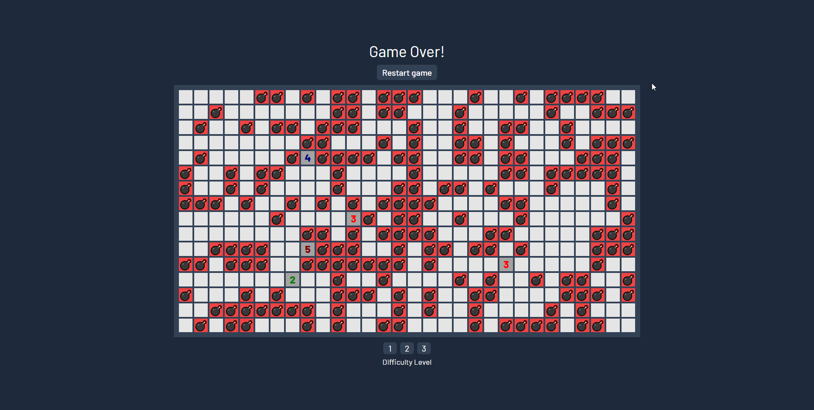

# OxiSweeperFrontend

  

### <a href="https://github.com/karolstawowski/OxiSweeperBackend">Link to OxiSweeperBackend</a>

## Description

<b>React/TypeScript</b> implementation of popular game called 'Minesweeper' made by Robert Donner. 
*OxiSweeperFrontend* implements the Minesweeper game itself and routing for users depending of theirs role. 
*OxiSweeperBackend* implements application user interface and database for user authentication, authorization and record tracking.

## Tools and technologies

React, TypeScript, Vite, React Router, tabler-icons.
